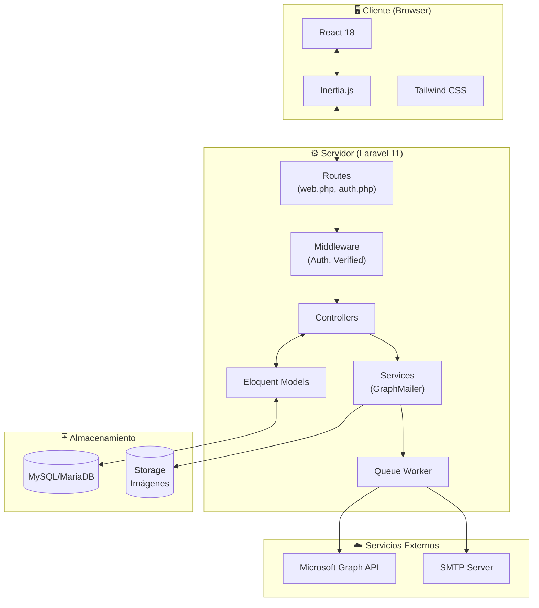
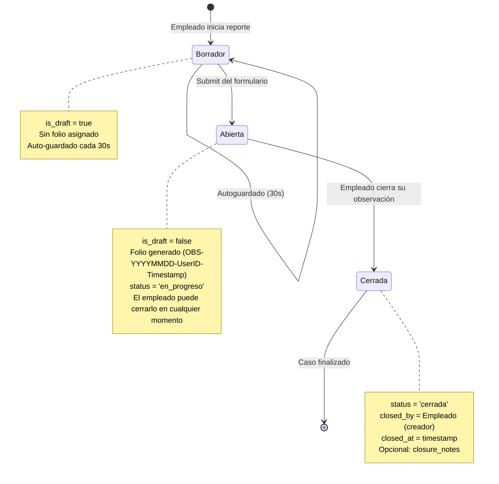
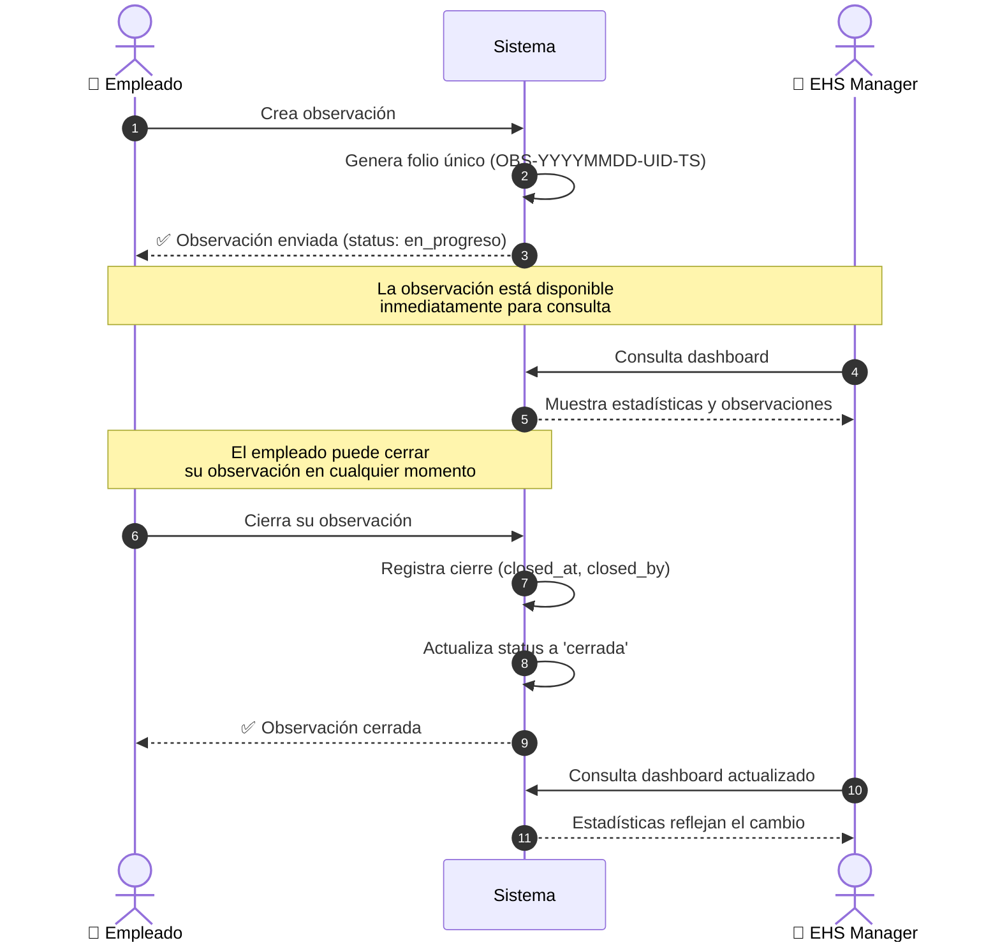
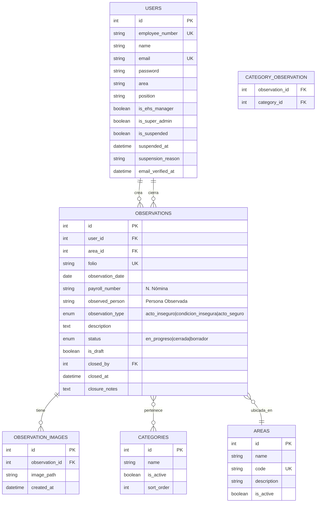
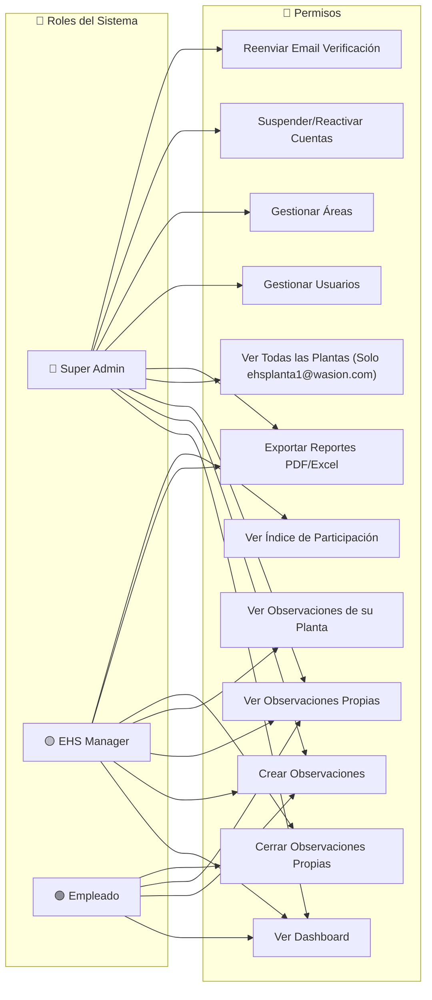
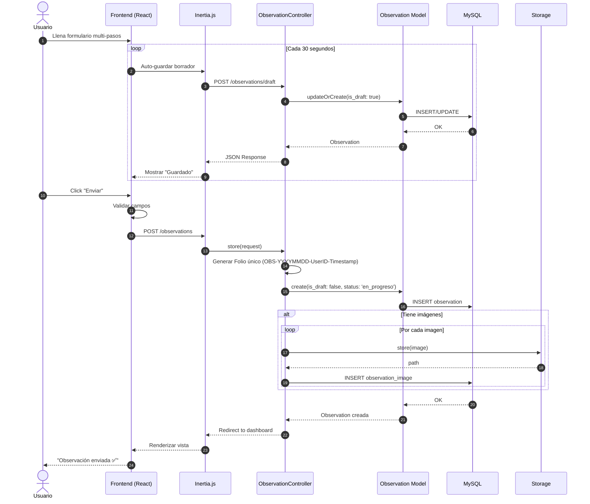
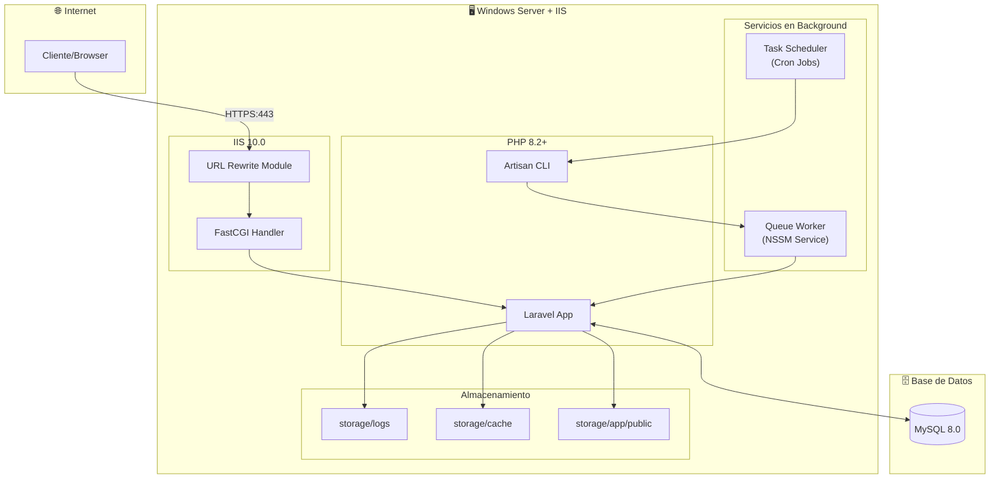
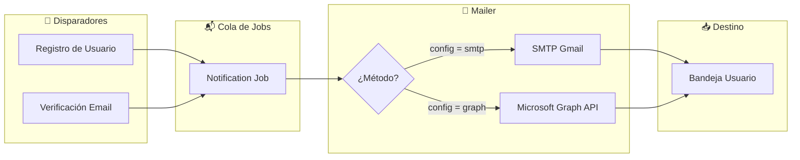
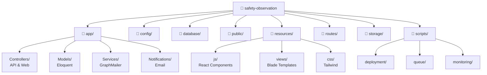

# WASION Safety Observer

<p align="center">
  <a href="https://laravel.com" target="_blank">
    
  </a>
</p>

<p align="center">
    
    
    
    
</p>

## 📋 Descripción

**WASION Safety Observer** es una aplicación web integral diseñada para la gestión de seguridad industrial (EHS). Permite a los empleados reportar actos y condiciones inseguras en tiempo real, mientras proporciona a la gerencia herramientas analíticas para la toma de decisiones.

El sistema está construido con una arquitectura moderna utilizando **Laravel 11** como API backend y **React** (vía Inertia.js) para una experiencia de usuario fluida y reactiva.

## 🚀 Características Principales

### 👷 Para Empleados

-   **Reporte de Observaciones:** Formulario multi-pasos intuitivo para registrar actos inseguros, condiciones inseguras o actos seguros.
-   **Autoguardado Inteligente:** Sistema de persistencia automática (drafts) que guarda el progreso cada 30 segundos o al detener la escritura, permitiendo retomar el reporte más tarde incluso tras recargar la página.
-   **Evidencia Fotográfica:** Carga múltiple de imágenes para respaldar los reportes.
-   **Campos Separados:** N. Nómina y Persona Observada como campos independientes para mejor trazabilidad.
-   **Cierre Inmediato:** Los empleados pueden cerrar sus propias observaciones sin necesidad de aprobación.
-   **Historial Personal:** Visualización de estatus de reportes propios (Abiertos/Cerrados).

### 📊 Para Gerentes EHS

-   **Dashboard Ejecutivo:** Vista centralizada con KPIs en tiempo real (Tasa de resolución, Riesgo Alto, Total del mes, Índice de Participación).
-   **Índice de Participación:** Métrica que muestra qué porcentaje de empleados está reportando activamente.
-   **Análisis de Datos:** Gráficas de distribución por planta y top de categorías críticas.
-   **Gestión de Reportes:** Tabla detallada de observaciones recientes con modales de vista rápida.
-   **Control por Planta:** Gerentes EHS solo ven datos de su planta asignada (excepto cuenta privilegiada que ve todas).
-   **Exportación:** Generación de reportes en **PDF** y **Excel (XLSX)** con formato profesional y filtros aplicados.

### 🛡️ Para Super Administradores

-   **Gestión de Usuarios:** CRUD completo de usuarios con asignación de roles (Empleado, EHS Manager, Super Admin).
-   **Control Total:** Capacidad de eliminar o editar cualquier registro del sistema.

## 📐 Arquitectura y Diagramas

### 🏗️ Arquitectura del Sistema



### 🔄 Flujo del Ciclo de Vida de una Observación



### 🔔 Flujo de Creación y Cierre de Observaciones



### 🗃️ Diagrama Entidad-Relación (ERD)



### 🔐 Sistema de Roles y Permisos



> **📌 Flujo simplificado:** El empleado crea la observación → La observación queda disponible inmediatamente → EHS Manager puede ver estadísticas y reportes → El empleado puede cerrar su observación cuando lo considere necesario.

### 📊 Diagrama de Secuencia: Crear Observación



### 🚀 Diagrama de Despliegue (IIS)



### 📧 Flujo de Notificaciones por Email



### 🗂️ Estructura de Carpetas del Proyecto



---

## 🛠️ Tecnologías Utilizadas

-   **Backend:** Laravel 11, PHP 8.2+
-   **Frontend:** React 18, Inertia.js
-   **Estilos:** Tailwind CSS
-   **Base de Datos:** MySQL / MariaDB
-   **Paquetes Clave:**
    -   `maatwebsite/excel`: Exportación a Excel/CSV con formato profesional.
    -   `barryvdh/laravel-dompdf`: Generación de reportes PDF.
    -   `microsoft/microsoft-graph`: Integración con Microsoft Graph API para envío de emails.
    -   `react-icons`: Iconografía dinámica.

## ⚙️ Instalación y Configuración

Sigue estos pasos para desplegar el proyecto en tu entorno local:

1.  **Clonar el repositorio**

    ```bash
    git clone [https://github.com/tu-usuario/safety-observation.git](https://github.com/tu-usuario/safety-observation.git)
    cd safety-observation
    ```

2.  **Instalar dependencias de PHP**

    ```bash
    composer install
    ```

3.  **Instalar dependencias de JavaScript**

    ```bash
    npm install
    ```

4.  **Configurar entorno**
    Copia el archivo de ejemplo y genera la clave de la aplicación:

    ```bash
    cp .env.example .env
    php artisan key:generate
    ```

    _Configura tus credenciales de base de datos en el archivo `.env`._

5.  **Crear enlace simbólico para imágenes**
    Este paso es crucial para visualizar las evidencias fotográficas:

    ```bash
    php artisan storage:link
    ```

6.  **Ejecutar migraciones**

    ```bash
    php artisan migrate --seed
    ```

7.  **Habilitar extensión GD (Para Excel)**
    Asegúrate de tener descomentada la línea `extension=gd` en tu `php.ini`.

## ▶️ Ejecución

Para correr el proyecto en desarrollo, necesitas dos terminales:

**Terminal 1 (Laravel):**

```bash
php artisan serve
# O para acceso en red local:
php artisan serve --host=0.0.0.0 --port=8000
```

**Terminal 2 (Vite):**

```bash
npm run dev
```

La aplicación estará disponible en `http://localhost:8000`.

## 🏭 Deployment en Producción (IIS)

Para desplegar la aplicación en un servidor Windows con IIS:

### 📚 Documentación Completa

Consulta **[docs/DEPLOYMENT-IIS.md](docs/DEPLOYMENT-IIS.md)** para la guía completa de instalación en IIS.

### ⚡ Quick Start

1. **Verificar requisitos del sistema:**

    ```powershell
    .\scripts\deployment\verify-system.ps1
    ```

2. **Deployment automático:**

    ```powershell
    .\scripts\deployment\deploy.ps1
    ```

3. **Checklist pre-deployment:**
   Ver [docs/DEPLOYMENT-CHECKLIST.md](docs/DEPLOYMENT-CHECKLIST.md)

### 📦 Scripts Disponibles

Todos los scripts están organizados en la carpeta `/scripts`:

-   **`/scripts/deployment`** - Scripts de deployment y rollback
-   **`/scripts/queue`** - Gestión del Queue Worker
-   **`/scripts/monitoring`** - Monitoreo del sistema
-   **`/scripts/scheduler`** - Configuración de tareas programadas

Ver [scripts/README.md](scripts/README.md) para más detalles.

### 🔧 Requisitos Mínimos

-   Windows Server 2016+ o Windows 10/11 Pro
-   IIS 10.0+ con URL Rewrite Module
-   PHP 8.2+
-   MySQL 8.0+
-   Node.js 18+
-   4 GB RAM (recomendado: 8 GB)

## 🔐 Usuarios por Defecto

Después de ejecutar las migraciones con seed, tendrás acceso a:

| Rol         | Email               | Contraseña |
| ----------- | ------------------- | ---------- |
| Super Admin | admin@wasion.com    | password   |
| EHS Manager | manager@wasion.com  | password   |
| Empleado    | employee@wasion.com | password   |

**⚠️ IMPORTANTE:** Cambia estas contraseñas en producción.

## 🧪 Testing

```bash
php artisan test
```
