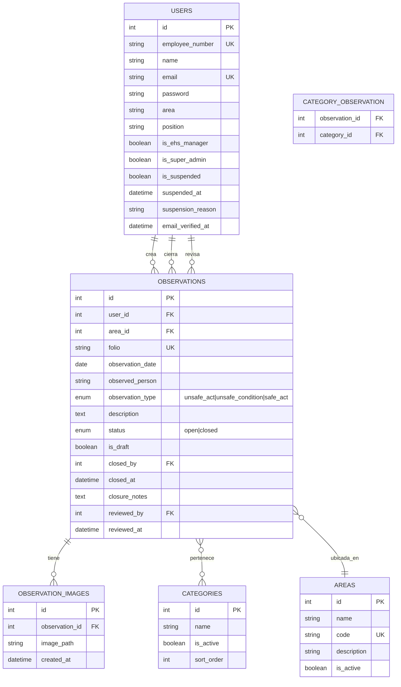

# WASION Safety Observer

<p align="center">
  <a href="https://laravel.com" target="_blank">
    
  </a>
</p>

<p align="center">
    
    
    
    
</p>

## 📋 Descripción

**WASION Safety Observer** es una aplicación web integral diseñada para la gestión de seguridad industrial (EHS). Permite a los empleados reportar actos y condiciones inseguras en tiempo real, mientras proporciona a la gerencia herramientas analíticas para la toma de decisiones.

El sistema está construido con una arquitectura moderna utilizando **Laravel 11** como API backend y **React** (vía Inertia.js) para una experiencia de usuario fluida y reactiva.

## 🚀 Características Principales

### 👷 Para Empleados

-   **Reporte de Observaciones:** Formulario multi-pasos intuitivo para registrar actos inseguros, condiciones inseguras o actos seguros.
-   **Autoguardado Inteligente:** Sistema de persistencia automática (drafts) que guarda el progreso cada 30 segundos o al detener la escritura, permitiendo retomar el reporte más tarde incluso tras recargar la página.
-   **Evidencia Fotográfica:** Carga múltiple de imágenes para respaldar los reportes.
-   **Historial Personal:** Visualización de estatus de reportes propios (Abiertos/Cerrados).

### 📊 Para Gerentes EHS

-   **Dashboard Ejecutivo:** Vista centralizada con KPIs en tiempo real (Tasa de resolución, Reincidencia, Total del mes).
-   **Análisis de Datos:** Gráficas de distribución por planta y top de categorías críticas.
-   **Gestión de Reportes:** Tabla detallada de observaciones recientes con modales de vista rápida.
-   **Exportación:** Generación de reportes en **PDF** y **CSV** (Excel) con un solo clic.

### 🛡️ Para Super Administradores

-   **Gestión de Usuarios:** CRUD completo de usuarios con asignación de roles (Empleado, EHS Manager, Super Admin).
-   **Control Total:** Capacidad de eliminar o editar cualquier registro del sistema.

## 📐 Arquitectura y Diagramas

### 🏗️ Arquitectura del Sistema

```mermaid
flowchart TB
    subgraph Cliente["🖥️ Cliente (Browser)"]
        React["React 18"]
        Inertia["Inertia.js"]
        Tailwind["Tailwind CSS"]
    end

    subgraph Servidor["⚙️ Servidor (Laravel 11)"]
        Routes["Routes<br/>(web.php, auth.php)"]
        Middleware["Middleware<br/>(Auth, Verified)"]
        Controllers["Controllers"]
        Models["Eloquent Models"]
        Services["Services<br/>(GraphMailer)"]
        Queue["Queue Worker"]
    end

    subgraph Storage["🗄️ Almacenamiento"]
        MySQL[("MySQL/MariaDB")]
        FileSystem[("Storage<br/>Imágenes")]
    end

    subgraph External["☁️ Servicios Externos"]
        Graph["Microsoft Graph API"]
        SMTP["SMTP Server"]
    end

    React <--> Inertia
    Inertia <--> Routes
    Routes --> Middleware
    Middleware --> Controllers
    Controllers <--> Models
    Controllers --> Services
    Models <--> MySQL
    Services --> FileSystem
    Services --> Queue
    Queue --> Graph
    Queue --> SMTP
```



### 🔄 Flujo del Ciclo de Vida de una Observación

```mermaid
stateDiagram-v2
    [*] --> Borrador: Empleado inicia reporte

    Borrador --> Borrador: Autoguardado (30s)
    Borrador --> Abierta: Submit del formulario

    Abierta --> Revisada: EHS Manager revisa
    
    state notificacion <<fork>>
    Revisada --> notificacion: Sistema notifica
    notificacion --> ListaParaCerrar: 📧 Notificación al Empleado
    
    ListaParaCerrar --> Cerrada: Empleado cierra su observación

    Cerrada --> [*]: Caso finalizado

    note right of Borrador
        is_draft = true
        Sin folio asignado
    end note

    note right of Abierta
        is_draft = false
        Folio generado
        status = 'open'
    end note

    note right of Revisada
        reviewed_by = EHS Manager
        reviewed_at = timestamp
    end note

    note right of Cerrada
        status = 'closed'
        closed_by = Empleado (creador)
        closed_at = timestamp
    end note
```



### 🔔 Flujo de Revisión y Notificación

```mermaid
sequenceDiagram
    autonumber
    actor E as 👷 Empleado
    participant S as Sistema
    actor M as 👔 EHS Manager

    E->>S: Crea observación
    S->>S: Genera folio único
    S-->>E: ✅ Observación enviada

    M->>S: Revisa observación
    S->>S: Marca como revisada (reviewed_at)
    S->>E: 📧 Notificación: "Lista para cerrar"
    
    Note over E,S: El empleado ve la notificación<br/>en su dashboard

    E->>S: Cierra su observación
    S->>S: Registra cierre (closed_at, closed_by)
    S-->>E: ✅ Observación cerrada
```



### 🗃️ Diagrama Entidad-Relación (ERD)



### 🔐 Sistema de Roles y Permisos

```mermaid
flowchart LR
    subgraph Roles["👥 Roles del Sistema"]
        SA["🔴 Super Admin"]
        EHS["🟡 EHS Manager"]
        EMP["🟢 Empleado"]
    end

    subgraph Permisos["🔑 Permisos"]
        P1["Ver Dashboard"]
        P2["Crear Observaciones"]
        P3["Ver Observaciones Propias"]
        P4["Ver Todas las Observaciones"]
        P5["Revisar Observaciones"]
        P6["Cerrar Observaciones Propias"]
        P7["Exportar Reportes PDF/CSV"]
        P8["Gestionar Usuarios"]
        P9["Gestionar Áreas"]
        P10["Suspender/Reactivar Cuentas"]
        P11["Reenviar Email Verificación"]
    end

    SA --> P1 & P2 & P3 & P8 & P9 & P10 & P11
    EHS --> P1 & P2 & P3 & P4 & P5 & P7
    EMP --> P1 & P2 & P3 & P6
```



> **📌 Flujo de cierre:** El empleado crea la observación → EHS Manager la revisa y marca como "revisada" → El empleado recibe notificación → El empleado cierra su propia observación.

### 📊 Diagrama de Secuencia: Crear Observación

```mermaid
sequenceDiagram
    autonumber
    actor U as Usuario
    participant F as Frontend (React)
    participant I as Inertia.js
    participant C as ObservationController
    participant M as Observation Model
    participant DB as MySQL
    participant S as Storage

    U->>F: Llena formulario multi-pasos

    loop Cada 30 segundos
        F->>I: Auto-guardar borrador
        I->>C: POST /observations/draft
        C->>M: updateOrCreate(is_draft: true)
        M->>DB: INSERT/UPDATE
        DB-->>M: OK
        M-->>C: Observation
        C-->>I: JSON Response
        I-->>F: Mostrar "Guardado"
    end

    U->>F: Click "Enviar"
    F->>F: Validar campos
    F->>I: POST /observations
    I->>C: store(request)
    C->>C: Generar Folio único
    C->>M: create(is_draft: false)
    M->>DB: INSERT observation

    alt Tiene imágenes
        loop Por cada imagen
            C->>S: store(image)
            S-->>C: path
            C->>DB: INSERT observation_image
        end
    end

    DB-->>M: OK
    M-->>C: Observation creada
    C-->>I: Redirect to dashboard
    I-->>F: Renderizar vista
    F-->>U: "Observación enviada ✅"
```



### 🚀 Diagrama de Despliegue (IIS)


### 📧 Flujo de Notificaciones por Email

```mermaid
flowchart LR
    subgraph Trigger["🎯 Disparadores"]
        T1["Registro de Usuario"]
        T2["Observación Revisada"]
        T3["Verificación Email"]
    end

    subgraph Queue["📬 Cola de Jobs"]
        Job["Notification Job"]
    end

    subgraph Mailer["📧 Mailer"]
        direction TB
        Check{"¿Método?"}
        SMTP["SMTP Gmail"]
        Graph["Microsoft Graph API"]
    end

    subgraph Destino["📥 Destino"]
        Email["Bandeja Usuario"]
    end

    T1 & T2 & T3 --> Job
    Job --> Check
    Check -->|config = smtp| SMTP
    Check -->|config = graph| Graph
    SMTP --> Email
    Graph --> Email
```



### 🗂️ Estructura de Carpetas del Proyecto

```mermaid
flowchart TB
    Root["📁 safety-observation"]

    Root --> App["📁 app/"]
    Root --> Config["📁 config/"]
    Root --> Database["📁 database/"]
    Root --> Public["📁 public/"]
    Root --> Resources["📁 resources/"]
    Root --> Routes["📁 routes/"]
    Root --> Storage["📁 storage/"]
    Root --> Scripts["📁 scripts/"]

    App --> Controllers["Controllers/<br/>API & Web"]
    App --> Models["Models/<br/>Eloquent"]
    App --> Services["Services/<br/>GraphMailer"]
    App --> Notifications["Notifications/<br/>Email"]

    Resources --> JS["js/<br/>React Components"]
    Resources --> Views["views/<br/>Blade Templates"]
    Resources --> CSS["css/<br/>Tailwind"]

    Scripts --> Deploy["deployment/"]
    Scripts --> Queue["queue/"]
    Scripts --> Monitor["monitoring/"]
```



---

## 🛠️ Tecnologías Utilizadas

-   **Backend:** Laravel 11, PHP 8.2+
-   **Frontend:** React 18, Inertia.js
-   **Estilos:** Tailwind CSS
-   **Base de Datos:** MySQL / MariaDB
-   **Paquetes Clave:**
    -   `maatwebsite/excel`: Exportación a Excel/CSV.
    -   `barryvdh/laravel-dompdf`: Generación de reportes PDF.
    -   `react-icons`: Iconografía dinámica.

## ⚙️ Instalación y Configuración

Sigue estos pasos para desplegar el proyecto en tu entorno local:

1.  **Clonar el repositorio**

    ```bash
    git clone [https://github.com/tu-usuario/safety-observation.git](https://github.com/tu-usuario/safety-observation.git)
    cd safety-observation
    ```

2.  **Instalar dependencias de PHP**

    ```bash
    composer install
    ```

3.  **Instalar dependencias de JavaScript**

    ```bash
    npm install
    ```

4.  **Configurar entorno**
    Copia el archivo de ejemplo y genera la clave de la aplicación:

    ```bash
    cp .env.example .env
    php artisan key:generate
    ```

    _Configura tus credenciales de base de datos en el archivo `.env`._

5.  **Crear enlace simbólico para imágenes**
    Este paso es crucial para visualizar las evidencias fotográficas:

    ```bash
    php artisan storage:link
    ```

6.  **Ejecutar migraciones**

    ```bash
    php artisan migrate --seed
    ```

7.  **Habilitar extensión GD (Para Excel)**
    Asegúrate de tener descomentada la línea `extension=gd` en tu `php.ini`.

## ▶️ Ejecución

Para correr el proyecto en desarrollo, necesitas dos terminales:

**Terminal 1 (Laravel):**

```bash
php artisan serve
# O para acceso en red local:
php artisan serve --host=0.0.0.0 --port=8000
```

**Terminal 2 (Vite):**

```bash
npm run dev
```

La aplicación estará disponible en `http://localhost:8000`.

## 🏭 Deployment en Producción (IIS)

Para desplegar la aplicación en un servidor Windows con IIS:

### 📚 Documentación Completa

Consulta **[docs/DEPLOYMENT-IIS.md](docs/DEPLOYMENT-IIS.md)** para la guía completa de instalación en IIS.

### ⚡ Quick Start

1. **Verificar requisitos del sistema:**

    ```powershell
    .\scripts\deployment\verify-system.ps1
    ```

2. **Deployment automático:**

    ```powershell
    .\scripts\deployment\deploy.ps1
    ```

3. **Checklist pre-deployment:**
   Ver [docs/DEPLOYMENT-CHECKLIST.md](docs/DEPLOYMENT-CHECKLIST.md)

### 📦 Scripts Disponibles

Todos los scripts están organizados en la carpeta `/scripts`:

-   **`/scripts/deployment`** - Scripts de deployment y rollback
-   **`/scripts/queue`** - Gestión del Queue Worker
-   **`/scripts/monitoring`** - Monitoreo del sistema
-   **`/scripts/scheduler`** - Configuración de tareas programadas

Ver [scripts/README.md](scripts/README.md) para más detalles.

### 🔧 Requisitos Mínimos

-   Windows Server 2016+ o Windows 10/11 Pro
-   IIS 10.0+ con URL Rewrite Module
-   PHP 8.2+
-   MySQL 8.0+
-   Node.js 18+
-   4 GB RAM (recomendado: 8 GB)

## 🔐 Usuarios por Defecto

Después de ejecutar las migraciones con seed, tendrás acceso a:

| Rol         | Email               | Contraseña |
| ----------- | ------------------- | ---------- |
| Super Admin | admin@wasion.com    | password   |
| EHS Manager | manager@wasion.com  | password   |
| Empleado    | employee@wasion.com | password   |

**⚠️ IMPORTANTE:** Cambia estas contraseñas en producción.

## 🧪 Testing

```bash
php artisan test
```
